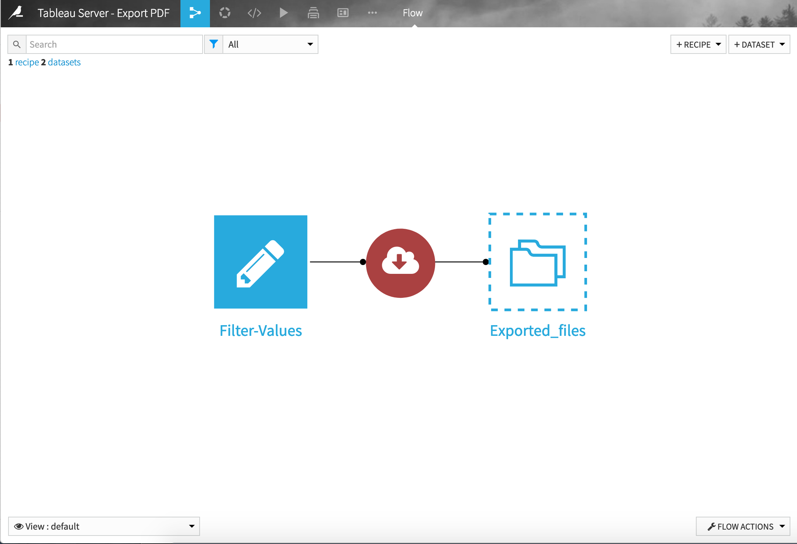
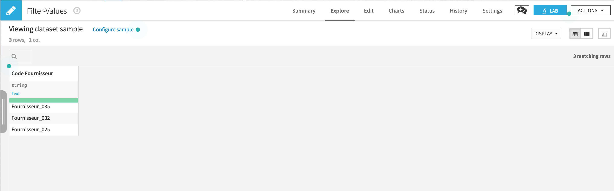
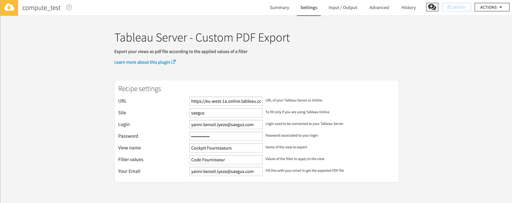

# Tableau Server - PDF Export

Export d'une vue depuis Tableau Server en fonction des filtres appliqués


## Présentation de la solution utilisée

Pour pouvoir exporter une vue dans un fichier PDF en fonction de valeurs d'un filtre, il faut utiliser différentes fonctionnalités de [l'API REST de Tableau Server](https://onlinehelp.tableau.com/current/api/rest_api/en-us/REST/rest_api_ref.htm).

Les scripts utilisés par la solution vont donc suivre les étapes suivantes:
1.  Envoyer une requête POST pour se connecter à une instance Tableau server et récupérer un token d'authentification qui va être utilisé ensuite pour tous les requêtes.
2.  Envoyer une requête GET pour rechercher la vue dans le serveur Tableau
3.  Pour chaque valeur du filtre demandée, le script va effectuer une requête GET pour effectuer l'export.
4.  Tous les exports par valeur du filtre sont regroupés dans un seul fichier

---

## Installation et utilisation avec Dataiku DSS

Tous les scripts utilisé dans ce répertoire ont été déployés dans un projet DSS afin qu'ils puissent être utilisés plus facilement.

Pour utiliser les script il faut importer les éléments présents dans le dossier `dataiku-dss`:
  1. Importer le plugin depuis l'espace d'administaration `dssPlugin_Tableau-APIs__2019_02_15.zip`
  2. Importer le projet complet `TABLEAUSERVERCONNECTORS.zip`

Une fois que les éléments sont importés, vous serez en mesure de faire fonctionner le projet.

### Mode d'emploi

Lorsque vous rendez sur le projet, vous devez observer 3 éléments:

- Un dataset `Filter_Values` qu'on peut éditer
- Un plugin `Tableau Server - Custom PDF Export` qui va faire appel au scripts
- Un dataset de sortie `Exported_files` qui contient le nom des fichiers qui ont été regroupé puis envoyés par mail



Avant de démarrer un job il faut tout d'abord éditer le premier dataset en inscrivant dans le nom de la colonne filtre utilisé par la vue tableau ainsi que les valeurs disponibles pour ce filtre dans les lignes.

Dans l'exemple ci-dessous, le nom du champ utilisé par Tableau est `Code Fournisseur`, je l'ai donc mis comme nom de colonne. J'ai rajouté sur ensuite sur chacune des lignes les valeurs souhaité pour ce filtre.

__Attention: Les scripts utilisent uniquement des APIs dont il faut absolument que les nom du filtre et ses valeurs soit identiques (à l'espace près) au nom des champs utilisé sur la vue Tableau afin que les scripts puissent retrouver les valeurs!__



Il faut ensuite configurer les paramètres du plugin.

__Attention__:
- __Le nom de la vue renseigné doit être strictement identique à celle affiché sur Tableau Server__
- __Pour que les scripts puissent utiliser l'API, il faut absolument que l'utilisateur Tableau Server renseigné soit administrateur et doit avoir accès à la vue pour laquelle l'export est demandé.__



Et enfin, vous n'avez plus qu'à démarrer le plugin.

---

## Organisation du répertoire

```
├── app ── exportPDF.py   <- Script python à utiliser pour faire l'export PDF
│
├── workbooks  <- Dossier contenant le workbook contenant la vue utilisée pour tester les scripts
│
├── dataiku-dss         <- Dossier contenant l'export du projet sous Dataiku DSS ainsi que le plugin associé
│   │
│   ├── dssPlugin_Tableau-APIs__2019_02_15.zip  <- Export d'un plugin DSS contenant les scripts
│   │
│   ├── TABLEAUSERVERCONNECTORS.zip <- Export du projet DSS pour utiliser les scripts
│
├── extension-tableau   <- Version du projet en javascript (C'est surtout un exemple, l'extension ne fonctionne pas)
│
├── connectors         <- Dossier contenant tous les scripts de connexion à Tableau server
│   │
│   ├── __init__.py           <- Fichier d'initialisation des scripts
│   │
│   ├── config.py           <- Configuration des scripts - A compléter avant de lancer les scripts
│   │
│   ├── tableau.py      <- Fichier python contenant les méthode de connexions à Tableau Server ainsi que l'export et l'envoie d'un fichier PDF par mail
│
├── README.md          <- Documentation du projet
├── requirements.txt   <- Liste des packages python à installer
├── setup.py           <- Configuration du projet
└── set_env.sh         <- Fichier bash qui permet d'automatiser l'installation de l'environnement technique de travail
```

## Fichier de configuration


Avant toute chose il faut compléter __avec précaution__ le fichier de configuration `config.py` dans le dossier `connectors`, ce fichier contient les informations de connexion vers Tableau server.

Si des informations sont mal renseignées, les scripts ne pourront pas fonctionner

## Mise en place de l'environnement technique de travail en local

- Télécharger anaconda / miniconda selon votre OS [lien](https://www.anaconda.com/download/#macos) version 3.x.

- Mettre en place l'environnement conda pour le projet

```bash
source set_env.sh
```

### Si jamais vous souhaitez créer votre propre environnement

```bash
conda create -n tableau python=3.5
```

Pour activer votre environnement conda:
```bash
source activate tableau
```

Installer un package dans l'environnement

```bash
source activate tableau
pip install pandas
```

Pour faire l'export de votre environnement :

```bash
conda env export | grep -v "^prefix: " > environment_OS.yml
```
### Si jamais vous faites des modifications dans le dossier connectors

Exécutez la commande suivante depuis la racine du répertoire du projet pour mettre à jour l'environnement:
```bash
pip install .
```
